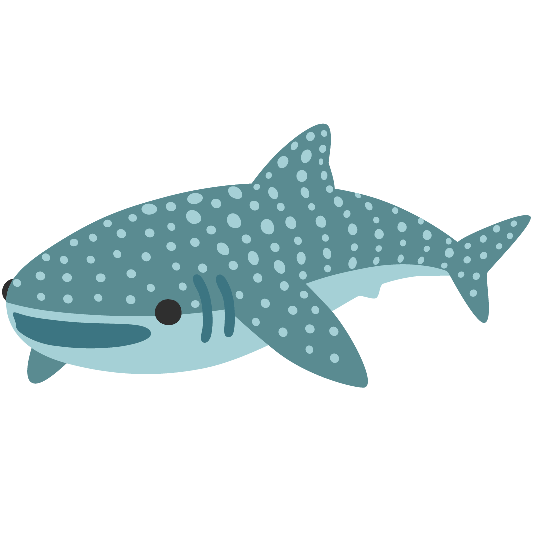
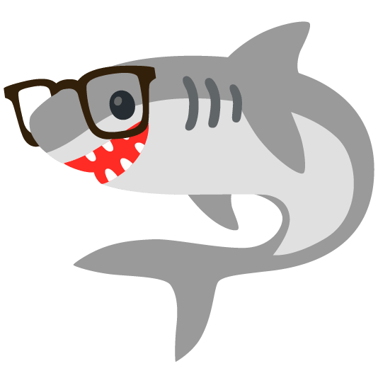

### HIIIII 

-  I’m currently working on ... shyanneringue.github.io
-  I’m currently learning ... new things everyday!
-  I’m looking to collaborate on ... anything
-  I’m looking for help with ... how to make these pictures load help (I did it WOO)
-  Ask me about ... anything
-  How to reach me: ... zeringueshyanne07.gmail.com
-  Pronouns: ... she/her
-  Fun fact: ... I love animals!
-->

<style type="text/css">
    img {
        width: 20px;
    }

<!--
**Shyanneringue/Shyanneringue** is a ✨ _special_ ✨ repository because its `README.md` (this file) appears on your GitHub profile.