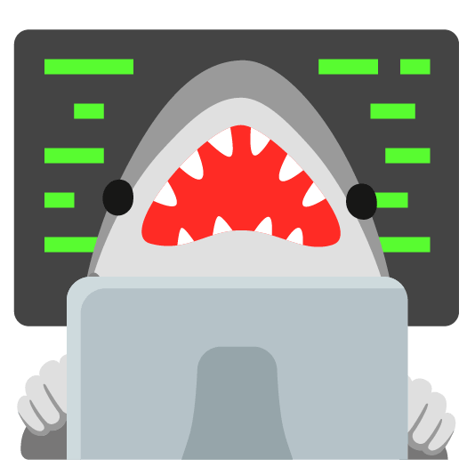
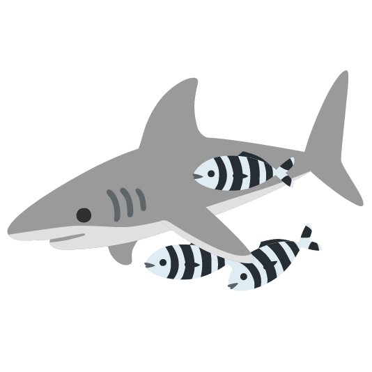
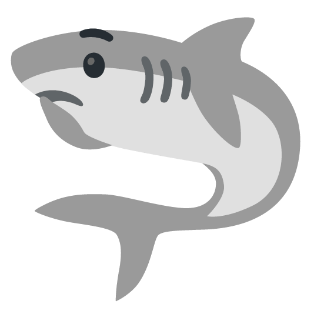
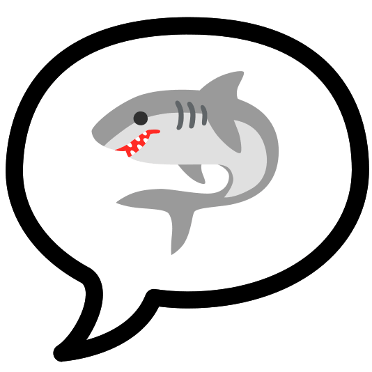
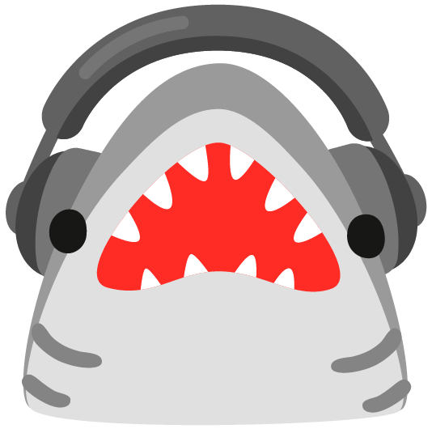
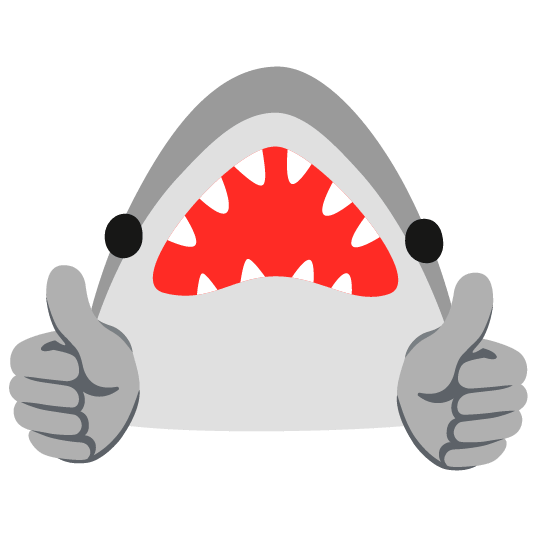

### HIIIII 

-  I’m currently working on ... shyanneringue.github.io
-  I’m currently learning ... how to make a website using JavaScript, HTML, and CSS.
-  I’m looking to collaborate on ... anything
-  I’m looking for help with ... how to make these pictures load help
-  Ask me about ... anything
-  How to reach me: ... Zering130.stcharles.k12.la.us
-  Pronouns: ... she/her
-  Fun fact: ... shark
-->

<!--
**Shyanneringue/Shyanneringue** is a ✨ _special_ ✨ repository because its `README.md` (this file) appears on your GitHub profile.